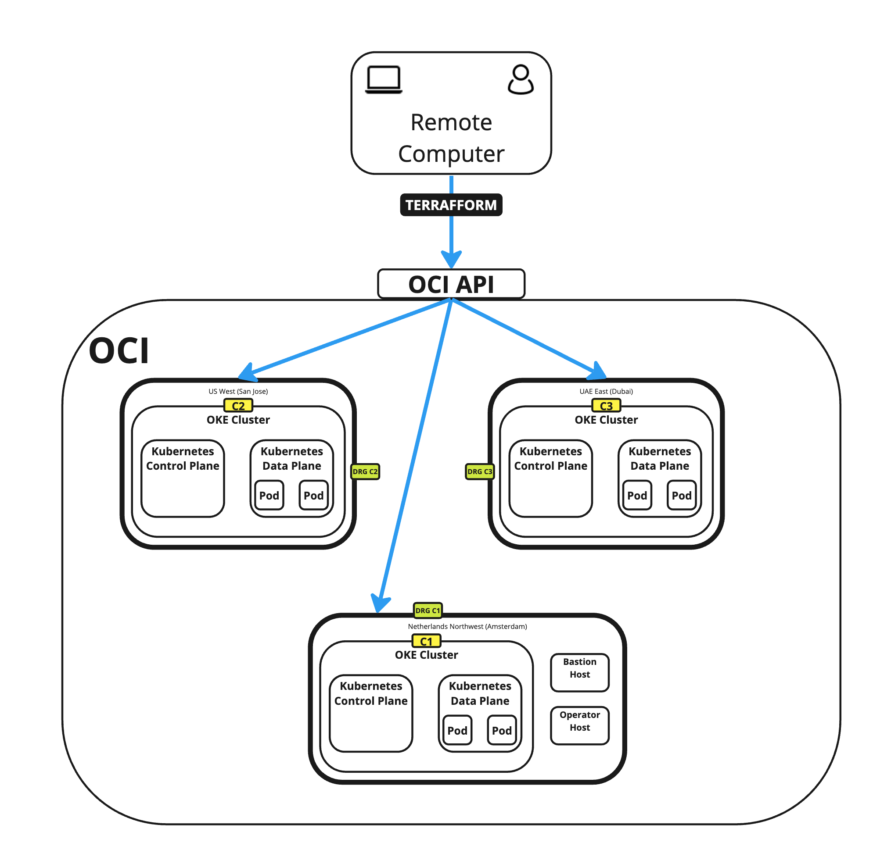

 # Use Terraform to Deploy Multiple Kubernetes Clusters across different OCI Regions using OKE and Create a Full Mesh Network using RPC
The files in this repository can be used to deploy three Kubernetes Clusters in three different OCI Regions using the Oracle Kubernetes Engine (OKE).
The full article with the full steps on how to do this can be found [on my personal website] (https://www.iwanhoogendoorn.nl/index.php/Use_Terraform_to_Deploy_Multiple_Kubernetes_Clusters_across_different_OCI_Regions_using_OKE_and_Create_a_Full_Mesh_Network_using_RPC
)

